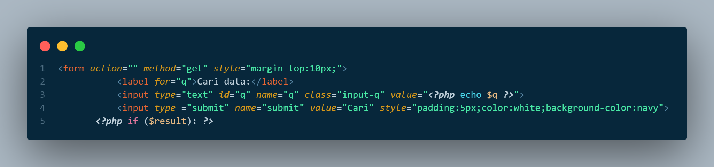
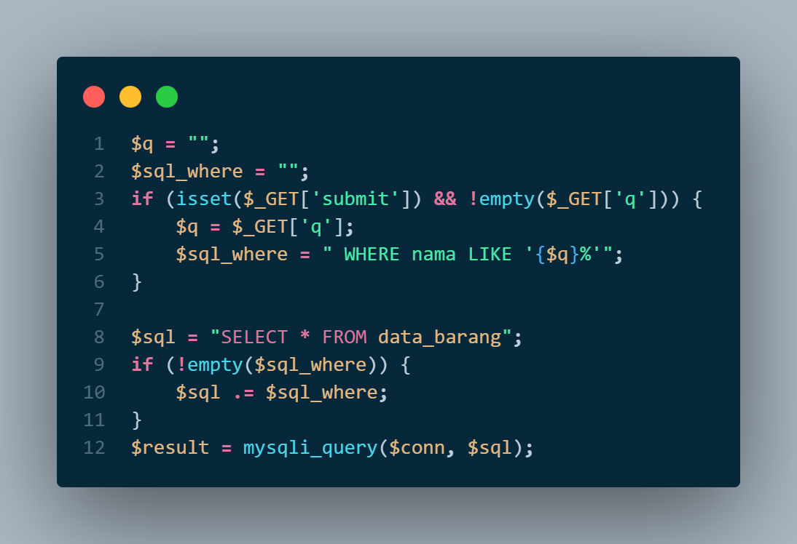
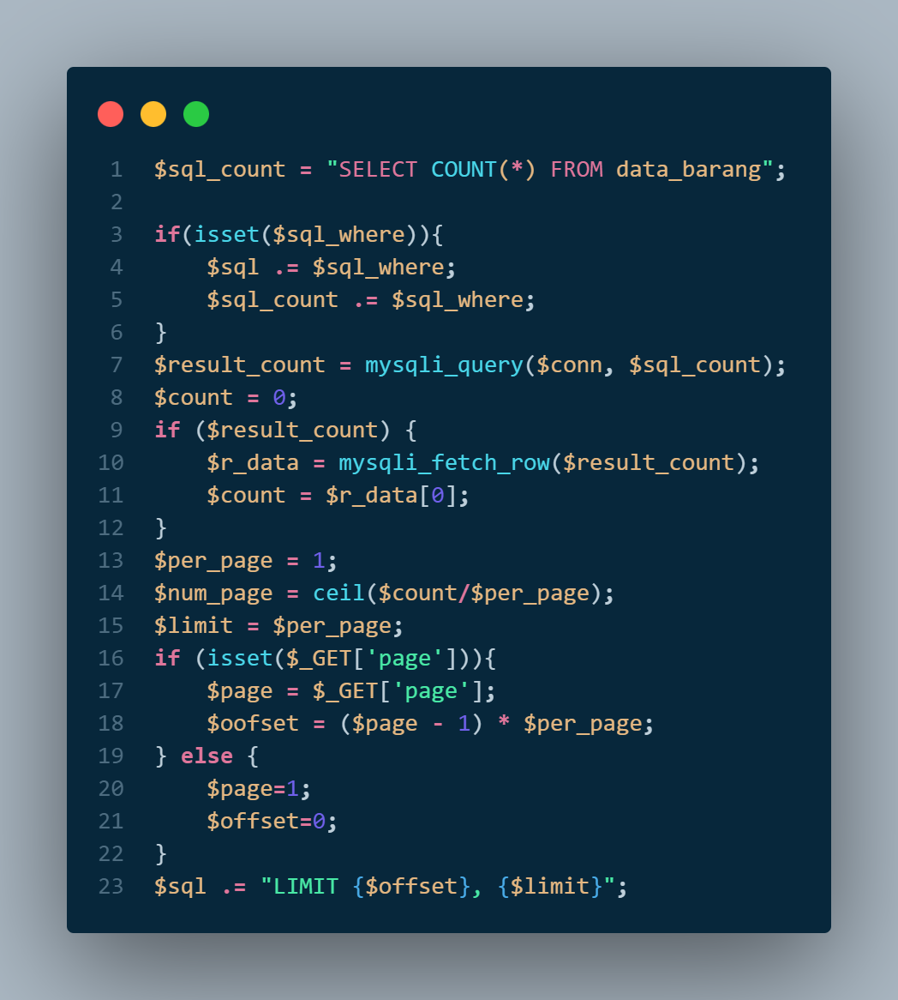
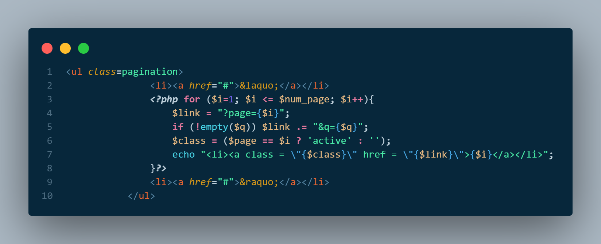
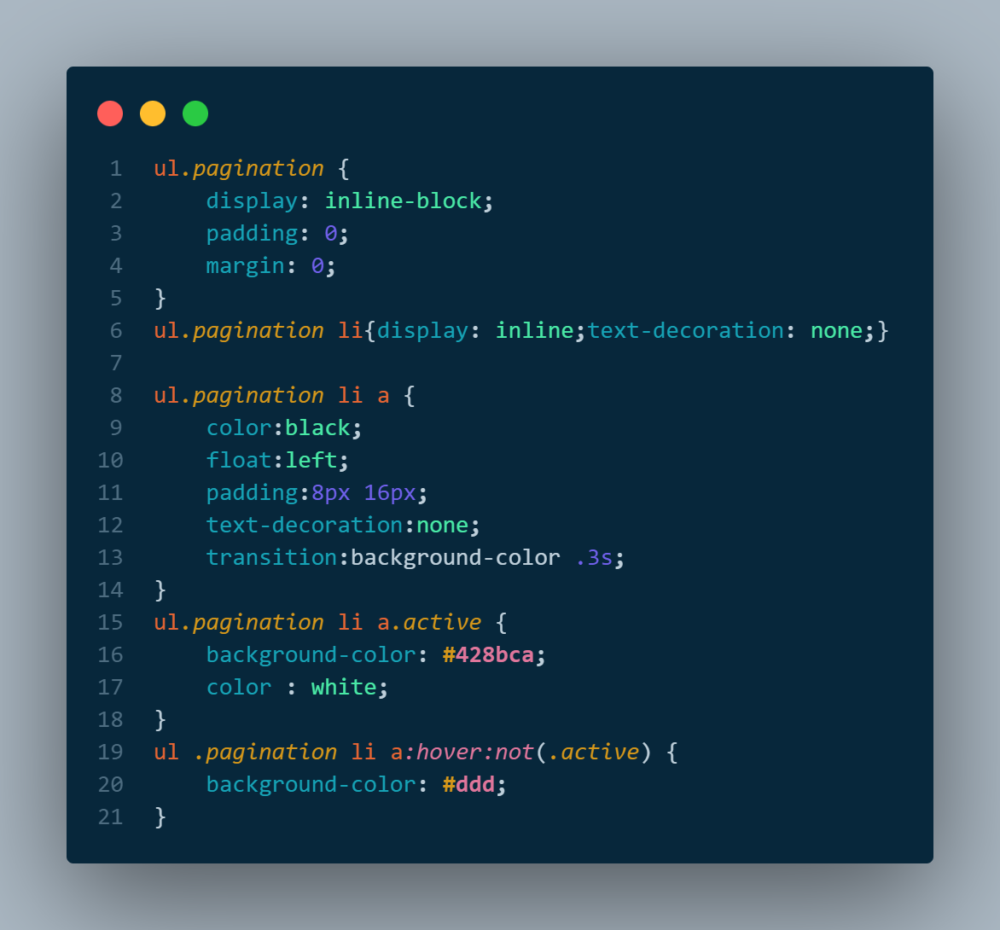
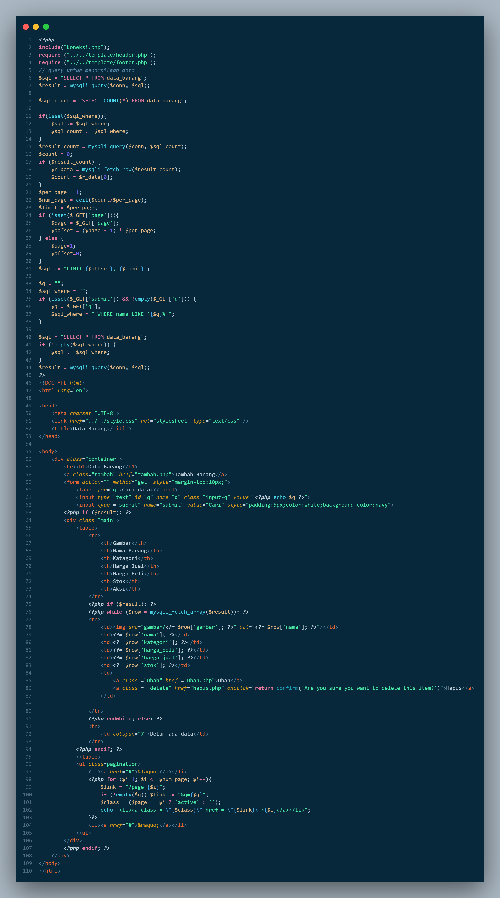
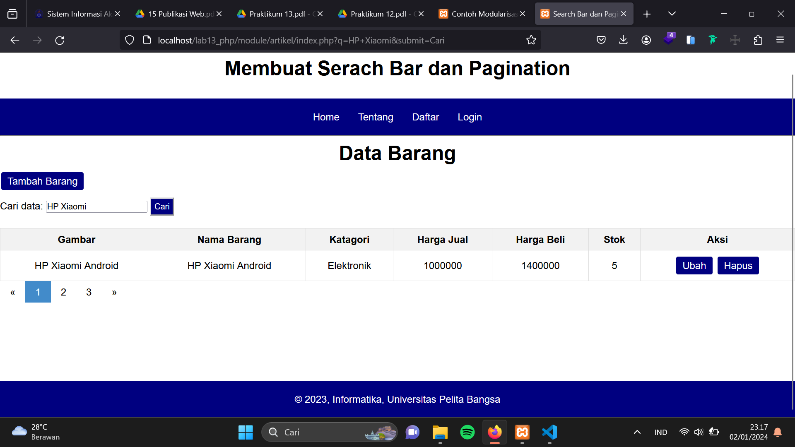

## Praktikum-13
## Langkah-langkah Praktikum
### Membuat Pencarian  Data atau Search Bar
- Untuk membuat pencarian data, yang perlu di perhatikan adalah penggunaan filter pada query data. 

- Pada data awal, query untuk menampilkan semua data adalah: 
  $sql = “SELECT * FROM data_barang”; 

- Nah untuk menambahkan pencarian, maka query tersebut harus ditambahkan klausa WHERE sebagai filter, sehingga menjadi: 
 $sql = “SELECT * FROM data_barang WHERE nama = ‘{$var_nama}’”; 

- Atau dapat juga menggunakan LIKE seperti berikut: 
 $sql = “SELECT * FROM data_barang WHERE nama LIKE ‘{$var_nama}%’”; 

Langkah selanjutnya adalah membuat form pencarian.

- Sisipkan kode tersebut pada file index.php (daftar barang), sebelum table data dan sesudah tombol
 tambah data.

Lalu rubah querynya dan tambahkan filter pencarian pada query tersebut.

### Membuat Pagination
- Pagination digunakan untuk membatasi atau membagi record data yang akan ditampilkan pada
 laman web. Dari seluruh record data yang ada akan dibagi berdasarkan jumlah record
 per-halaman.

- Pada prinsipnya untuk membatasi tampilan record data pada query mysql menggunakan LIMIT
 dan OFFSET;

- Query awal:
 $sql = “SELECT * FROM tabel_barang”;

- Untuk menapilkan data dari record ke 1 sampai record ke 10:
 $sql = “SELECT * FROM table_barang LIMIT 10”;

- Untuk menampilkan data dari receord ke 11 sampai dengan record ke 20, disini digunakan
 OFFSET:
 $sql = “SELECT * FROM table_barang LIMIT 10,20”;

- Untuk membagi jumlah halaman, tentu kita harus ketahui dulu jumlam record secara keseluruhan,
 selanjutnya di bagi dengan jumlah record per halaman, maka akan diketahui jumlah halamannya.

- Untuk mengetahui jumlah record secara keseluruhan:
 $sql = “SELECT COUNT(*) FROM table_barang”;

- Misal resultnya adalah 30 record, akan ditampilkan perhalaman sejumlah 10 record, maka:
 $page = $row_count / $per_page; ==> 3 = 30/10

- Maka akan dihasilkan 3 halaman, sehingga paging dibuat menjadi tiga tombol (1, 2, 3).

- File: index.php
 Lakukan perubahan code mulai baris 10:

- Selanjutnya tambahkan code berikut setelah tabel data:

- Tambahkan CSS untutk tampilan Pagination

## Source Code index.php

## Output Pencarian Data dan Pagination

